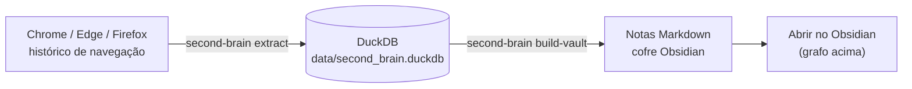

# Second Brain para Obsidian

[](https://github.com/irioam/second-brain/actions/workflows/ci.yml)
[](https://www.python.org/downloads/)
[](LICENSE)

> Leia este documento em inglês: [README.md](README.md)

Se você pesquisa muito, provavelmente já perdeu links importantes no meio de abas, histórico limpo, favoritos esquecidos ou conversas antigas.

O Second Brain para Obsidian transforma seu histórico de navegação em uma memória local e pesquisável. Ele coleta URLs, títulos, domínios, datas de visita e contagem de acessos, salva tudo em DuckDB e gera notas Markdown para você explorar no Obsidian.

A ideia é simples: sua trilha de pesquisa vira uma base de conhecimento pessoal, sem depender de nuvem e sem enviar seus dados por padrão.


## O que ele faz

Hoje o Second Brain faz quatro coisas principais:

1. Lê o histórico local do Chrome, Edge e Firefox.
2. Salva os dados em um banco DuckDB em `data/second_brain.duckdb`.
3. Gera arquivos Markdown para abrir como um cofre no Obsidian.
4. Opcionalmente cria agrupamentos semânticos por tema.



O comando `extract` é incremental. Ele não apaga o banco quando o navegador está sem histórico. Se você limpar o histórico do navegador, os dados antigos já salvos no DuckDB continuam preservados.

## Por que usar?

Use este projeto se você pesquisa, estuda, escreve, desenvolve software, analisa temas ou usa o Obsidian como base de conhecimento.

Na prática, ele ajuda você a:

- Reencontrar páginas que já visitou.
- Preservar referências depois de limpar o histórico do navegador.
- Revisar o que você pesquisou ao longo do tempo.
- Criar uma base pessoal de estudos, trabalho e pesquisa.
- Manter metadados sensíveis de navegação no seu próprio computador.

Brutalmente honesto: este projeto não é para todo mundo. Se você só navega casualmente e precisa apenas de um histórico normal, talvez o navegador já baste.

## O que ele ainda não faz

Hoje o projeto organiza o histórico e cria notas estruturadas. Ele ainda não captura nem resume automaticamente o conteúdo completo das páginas.

As notas geradas são um ponto de partida. Elas ajudam você a encontrar, classificar e revisar links, mas a curadoria final ainda é sua.

## Comece rápido

Você precisa de:

- Windows.
- PowerShell.
- Git.
- Python 3.11 ou mais novo.
- `uv`, que instala e executa o projeto.
- Obsidian, se quiser abrir as notas geradas como um cofre. [Download - Obsidian](https://obsidian.md/download)

Escolha onde você quer guardar o projeto:

```powershell
cd C:\my_projects
```

Confira se o Python existe:

```powershell
python --version
```

Instale o `uv`, se ainda não tiver:

```powershell
powershell -ExecutionPolicy ByPass -c "irm https://astral.sh/uv/install.ps1 | iex"
```

Feche e abra o PowerShell de novo, então clone o projeto:

```powershell
git clone https://github.com/irioam/second-brain.git
```

Entre na pasta do projeto:

```powershell
cd second-brain
```

Instale as dependências do projeto:

```powershell
uv sync
```

Teste se a CLI responde:

```powershell
uv run second-brain --help
```

Se aparecer uma lista de comandos, a instalação funcionou.

## Comandos principais

### `extract`

Lê o histórico dos navegadores e sincroniza o banco DuckDB.

```powershell
uv run second-brain extract
```

Use este comando quando quiser atualizar o banco com visitas novas.

### `build-vault --dry-run`

Simula a criação das notas do Obsidian, sem escrever arquivos.

```powershell
uv run second-brain build-vault --dry-run
```

Use este comando para testar com segurança.

### `build-vault`

Gera as notas Markdown no cofre Obsidian.

```powershell
uv run second-brain build-vault
```

Se quiser escolher o caminho do cofre:

```powershell
uv run second-brain build-vault --vault-path "C:\obsidian\my_vault\second_brain"
```

### `all`

Executa o pipeline completo em sequência:

1. Executa `extract`.
2. Executa `build-vault`.
3. Executa `build-semantic`.

```powershell
uv run second-brain all
```

Com caminho do cofre:

```powershell
uv run second-brain all --vault-path "C:\obsidian\my_vault\second_brain"
```

Para simular sem escrever arquivos:

```powershell
uv run second-brain all --dry-run
```

Na primeira execução completa, a etapa semântica pode demorar porque pode carregar
ou baixar modelos de embeddings.

### `build-semantic --dry-run`

Simula os agrupamentos semânticos.

```powershell
uv run second-brain build-semantic --dry-run
```

### `build-semantic`

Cria agregadores por tema em `03 - Aggregators`.

```powershell
uv run second-brain build-semantic
```

Na primeira execução, esse comando pode demorar porque pode carregar ou baixar modelos de embeddings.

## Receitas prontas

### Primeira execução segura

Use estes comandos para testar sem criar notas ainda:

```powershell
uv run second-brain extract
uv run second-brain build-vault --dry-run
```

### Execução completa

```powershell
uv run second-brain all
```

### Execução completa com caminho do cofre

```powershell
uv run second-brain all --vault-path "C:\obsidian\my_vault\second_brain"
```

### Rodar testes

```powershell
uv run pytest
```

## Opções úteis da CLI

| Opção | Para que serve |
|---|---|
| `--db-path` | Muda o caminho do banco DuckDB. |
| `--vault-path` | Muda o caminho do cofre Obsidian. |
| `--dry-run` | Mostra o que aconteceria sem escrever arquivos. |
| `--limit` | Limita a quantidade de notas ou fontes processadas. |
| `--min-visit-count` | Usa apenas URLs com uma quantidade mínima de visitas. |
| `--n-clusters` | Define quantos grupos semânticos serão criados. |
| `--embedding-model` | Escolhe o modelo usado para embeddings. |
| `--llm-provider` | Escolhe um provedor para rótulos/resumos. O padrão é `none`. |

## Opções semânticas: embeddings e provedor LLM

`--embedding-model` controla qual modelo `sentence-transformers` será usado para
transformar cada fonte em um vetor de embedding. O padrão é
`sentence-transformers/all-MiniLM-L6-v2`.

Hoje, a entrada semântica é intencionalmente compacta. Cada fonte é representada
pelo título, domínio e tipo da fonte. Esses embeddings influenciam diretamente
os clusters semânticos criados por `build-semantic` e `all`.

Se o modelo ou o runtime local de ML não puder ser carregado, o projeto usa um
fallback local determinístico baseado em hash. Isso mantém o comando utilizável,
mas a qualidade semântica pode ser menor do que com um modelo real de embeddings.

`--llm-provider` aceita `none`, `openai`, `anthropic` e `gemini`. O padrão é
`none`. Na versão atual, essa opção não chama APIs externas. Os rótulos dos
clusters são gerados localmente a partir de termos frequentes.

Se você escolher um provider diferente de `none`, o resumo gerado para o cluster
apenas informa que a sumarização automática está indisponível para aquele
provider. A integração real com LLMs está planejada para uma versão futura.

Uso local recomendado:

```powershell
uv run second-brain build-semantic --embedding-model sentence-transformers/all-MiniLM-L6-v2 --llm-provider none
```

## Onde os arquivos ficam

O banco principal fica aqui:

```text
data/second_brain.duckdb
```

As notas do Obsidian seguem uma estrutura parecida com esta:

```text
00 - Index/
01 - Sources/
02 - Topics/
03 - Daily/
03 - Aggregators/
99 - Attachments/
```

O exemplo completo está em [vault_structure_sample.md](vault_structure_sample.md).

## Privacidade

Este projeto lida com histórico de navegação, que pode ser sensível. Por padrão:

- Seus dados ficam locais no seu computador.
- O histórico dos navegadores é consolidado localmente no DuckDB.
- As notas Markdown são escritas apenas no caminho de cofre que você escolher.
- Arquivos Markdown existentes no Obsidian não são sobrescritos.
- Chamadas para APIs externas não são obrigatórias por padrão.

Evite publicar o banco DuckDB ou as notas geradas sem revisar antes. Leia [docs/privacy.md](docs/privacy.md) para detalhes.

## Limitações atuais

Este projeto está em desenvolvimento ativo. Algumas limitações existem:

- **Apenas Windows** - Atualmente suporta Chrome, Edge e Firefox no Windows. Suporte cross-platform para Linux e macOS está planejado.
- **Apenas metadados** - A ferramenta captura URLs, títulos, domínios, contagem de visitas e timestamps. O conteúdo das páginas não é capturado ou resumido.
- **Local-first** - Todos os dados ficam na sua máquina. Sem sync em nuvem ou chamadas de API por padrão.
- **Clustering semântico é opcional** - Embeddings e clusterização exigem `scikit-learn` e `sentence-transformers`. O projeto faz fallback para agrupamento por hash quando indisponível.

Consulte [docs/roadmap.md](docs/roadmap.md) para funcionalidades planejadas.

## Como contribuir

Contribuições são bem-vindas, principalmente em áreas que deixam o projeto mais útil sem comprometer privacidade.

Áreas de alto valor:

- Suporte a Linux e macOS.
- Filtros melhores para remover ruído do histórico.
- Um comando de busca para encontrar fontes já visitadas.
- Melhorias na geração do cofre Obsidian.
- Testes para banco, CLI e saída Markdown.
- Documentação para usuários iniciantes.

Antes de abrir um PR, leia [CONTRIBUTING.md](CONTRIBUTING.md) e [docs/privacy.md](docs/privacy.md).

## Gostou do projeto?

Se este projeto ajudou você a recuperar links, organizar pesquisas ou criar uma base pessoal no Obsidian, considere deixar uma Star no GitHub.

Isso ajuda outras pessoas a encontrarem o projeto e mostra que vale a pena continuar evoluindo a ferramenta.

Sugestões também são bem-vindas. Abra uma issue se tiver uma ideia, um bug ou um caso de uso prático que o projeto deveria atender.

## Documentação detalhada

Para detalhes técnicos, leia:

- [Referência da CLI](docs/cli-reference.md)
- [Pipeline interno](docs/pipeline-overview.md)
- [Roadmap](docs/roadmap.md)
- [Privacidade](docs/privacy.md)

## Estrutura resumida do projeto

```text
second_brain/
  cli.py
  extraction.py
  database.py
  vault.py
  semantic.py
  templates.py
README.md
docs/
  cli-reference.md
  pipeline-overview.md
  privacy.md
  roadmap.md
```

## Licença

Este projeto está licenciado sob a licença MIT. Consulte [LICENSE](LICENSE) para ler o texto completo da licença.

Você pode usar, modificar e distribuir este projeto, desde que mantenha os créditos ao autor original.

Copyright (c) 2026 Irio Andre Moesch.

GitHub: [https://github.com/irioam/second-brain](https://github.com/irioam/second-brain)
