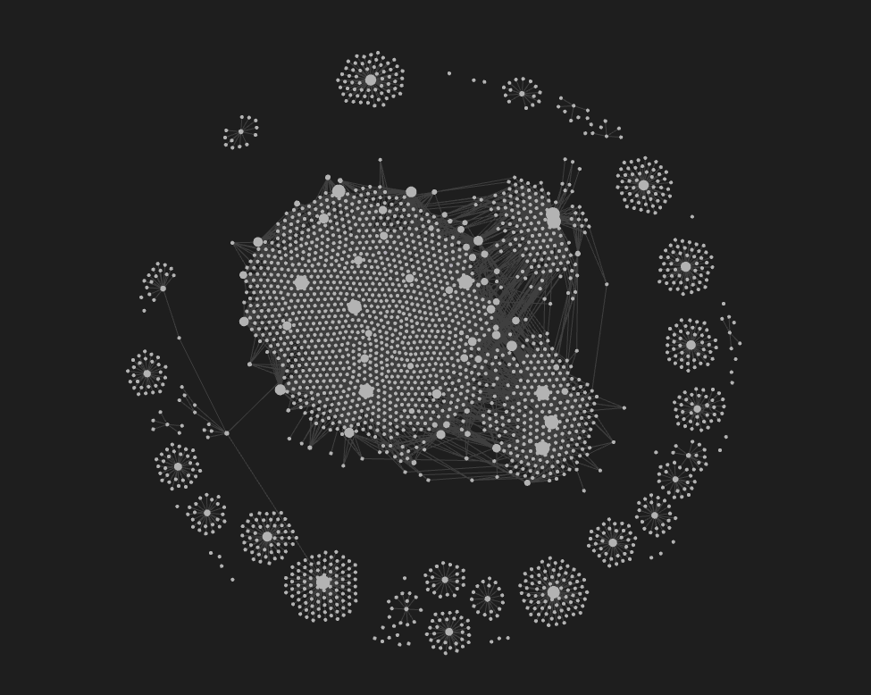
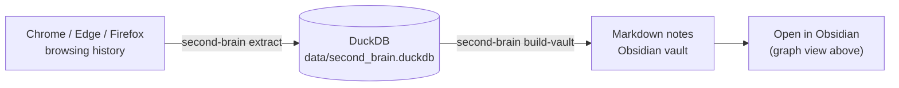

# Second Brain for Obsidian

[](https://github.com/irioam/second-brain/actions/workflows/ci.yml)
[](https://www.python.org/downloads/)
[](LICENSE)

> Read this document in Portuguese: [README pt-BR.md](README%20pt-BR.md)

If you research a lot, you have probably lost useful links in old tabs, cleared browser history, forgotten bookmarks, or scattered conversations.

Second Brain for Obsidian turns your browsing history into a local, searchable memory. It collects URLs, titles, domains, visit dates, and visit counts, stores them in DuckDB, and generates Markdown notes you can explore in Obsidian.

The idea is simple: your research trail becomes a personal knowledge base, without depending on cloud sync and without sending your data anywhere by default.



## What It Does

Second Brain currently does four main things:

1. Reads local browsing history from Chrome, Edge, and Firefox.
2. Saves the data in a DuckDB database at `data/second_brain.duckdb`.
3. Generates Markdown files that can be opened as an Obsidian vault.
4. Optionally creates semantic topic clusters.



The `extract` command is incremental. It does not delete the database when the browser has no history. If you clear your browser history, data already saved in DuckDB remains preserved.

## Why Use It?

Use this project if you research, study, write, build software, analyze topics, or use Obsidian as a knowledge base.

In practice, it helps you:

- Find pages you already visited.
- Preserve references after clearing browser history.
- Review what you researched over time.
- Build a personal knowledge base for study, work, and research.
- Keep sensitive browsing metadata on your own computer.

Brutally honest: this project is not for everyone. If you browse casually and only need a normal browser history, your browser may already be enough.

## What It Does Not Do Yet

Today, the project organizes browsing history and creates structured notes. It does not yet capture or automatically summarize the full content of web pages.

The generated notes are a starting point. They help you find, classify, and review links, but the final curation is still yours.

## Quick Start

You need:

- Windows.
- PowerShell.
- Git.
- Python 3.11 or newer.
- `uv`, which installs and runs the project.
- Obsidian, if you want to open the generated notes as a vault. [Download - Obsidian](https://obsidian.md/download)

Choose where you want to keep the project:

```powershell
cd C:\my_projects
```

Check Python:

```powershell
python --version
```

Install `uv`, if you do not have it yet:

```powershell
powershell -ExecutionPolicy ByPass -c "irm https://astral.sh/uv/install.ps1 | iex"
```

Close and reopen PowerShell, then clone the project:

```powershell
git clone https://github.com/irioam/second-brain.git
```

Go to the project folder:

```powershell
cd second-brain
```

Install the project dependencies:

```powershell
uv sync
```

Test if the CLI responds:

```powershell
uv run second-brain --help
```

If a list of commands appears, the installation worked.

## Main Commands

### `extract`

Reads browser history and syncs the DuckDB database.

```powershell
uv run second-brain extract
```

Use this command when you want to update the database with new visits.

### `build-vault --dry-run`

Simulates creating the Obsidian notes without writing files.

```powershell
uv run second-brain build-vault --dry-run
```

Use this command to test safely.

### `build-vault`

Generates Markdown notes in the Obsidian vault.

```powershell
uv run second-brain build-vault
```

If you want to choose the vault path:

```powershell
uv run second-brain build-vault --vault-path "C:\obsidian\my_vault\second_brain"
```

### `all`

Runs the full pipeline in sequence:

1. Runs `extract`.
2. Runs `build-vault`.
3. Runs `build-semantic`.

```powershell
uv run second-brain all
```

With a vault path:

```powershell
uv run second-brain all --vault-path "C:\obsidian\my_vault\second_brain"
```

To simulate without writing files:

```powershell
uv run second-brain all --dry-run
```

On the first full run, the semantic step may take longer because it may load or
download embedding models.

### `build-semantic --dry-run`

Simulates semantic clustering.

```powershell
uv run second-brain build-semantic --dry-run
```

### `build-semantic`

Creates topic aggregators in `03 - Aggregators`.

```powershell
uv run second-brain build-semantic
```

On the first run, this command may take longer because it may load or download embedding models.

## Ready-To-Use Recipes

### Safe First Run

Use these commands to test without creating notes yet:

```powershell
uv run second-brain extract
uv run second-brain build-vault --dry-run
```

### Full Run

```powershell
uv run second-brain all
```

### Full Run With Vault Path

```powershell
uv run second-brain all --vault-path "C:\obsidian\my_vault\second_brain"
```

### Run Tests

```powershell
uv run pytest
```

## Useful CLI Options

| Option | What It Does |
|---|---|
| `--db-path` | Changes the DuckDB database path. |
| `--vault-path` | Changes the Obsidian vault path. |
| `--dry-run` | Shows what would happen without writing files. |
| `--limit` | Limits the number of notes or sources processed. |
| `--min-visit-count` | Uses only URLs with a minimum number of visits. |
| `--n-clusters` | Defines how many semantic groups will be created. |
| `--embedding-model` | Chooses the model used for embeddings. |
| `--llm-provider` | Chooses a provider for labels/summaries. The default is `none`. |

## Semantic Options: Embeddings and LLM Provider

`--embedding-model` controls which `sentence-transformers` model is used to
turn each source into an embedding vector. The default is
`sentence-transformers/all-MiniLM-L6-v2`.

Today, the semantic input is intentionally compact. Each source is represented
by its title, domain, and source type. Those embeddings directly influence the
semantic clusters created by `build-semantic` and `all`.

If the model or local ML runtime cannot be loaded, the project falls back to a
deterministic local hash-based embedding. This keeps the command usable, but the
semantic quality may be lower than with a real embedding model.

`--llm-provider` accepts `none`, `openai`, `anthropic`, and `gemini`. The default
is `none`. In the current version, this option does not call external APIs.
Cluster labels are generated locally from frequent terms.

If you choose a provider other than `none`, the generated cluster summary only
states that automatic summarization is unavailable for that provider. Real LLM
integration is planned for a future version.

Recommended local usage:

```powershell
uv run second-brain build-semantic --embedding-model sentence-transformers/all-MiniLM-L6-v2 --llm-provider none
```

## Where Files Are Stored

The main database is stored here:

```text
data/second_brain.duckdb
```

The Obsidian notes follow a structure similar to this:

```text
00 - Index/
01 - Sources/
02 - Topics/
03 - Daily/
03 - Aggregators/
99 - Attachments/
```

The full example is available in [vault_structure_sample.md](vault_structure_sample.md).

## Privacy

This project handles browser history, which can be sensitive. By default:

- Your data stays local on your computer.
- Browser history is consolidated into DuckDB locally.
- Generated Markdown notes are written only to the vault path you choose.
- Existing Markdown files in Obsidian are not overwritten.
- External API calls are not required by default.

Avoid publishing the DuckDB database or generated notes before reviewing them. Read [docs/privacy.md](docs/privacy.md) for details.

## Current Limitations

This project is actively developed. Some limitations exist:

- **Windows only** - Currently supports Chrome, Edge, and Firefox on Windows. Cross-platform support for Linux and macOS is planned.
- **Metadata only** - The tool captures URLs, titles, domains, visit counts, and timestamps. Page content is not captured or summarized.
- **Local-first** - All data stays on your machine. No cloud sync or API calls by default.
- **Semantic clustering is optional** - Embeddings and clustering require `scikit-learn` and `sentence-transformers`. The project falls back to hash-based grouping when unavailable.

See [docs/roadmap.md](docs/roadmap.md) for planned features.

## How To Contribute

Contributions are welcome, especially changes that make the project more useful without compromising privacy.

High-value areas include:

- Linux and macOS support.
- Better filters for noisy browser history entries.
- A search command for finding previously visited sources.
- Improvements to Obsidian vault generation.
- Tests for database behavior, CLI commands, and Markdown output.
- Documentation for first-time users.

Before opening a pull request, read [CONTRIBUTING.md](CONTRIBUTING.md) and [docs/privacy.md](docs/privacy.md).

## Like The Project?

If this project helped you recover links, organize research, or build a personal knowledge base in Obsidian, consider giving it a Star on GitHub.

That helps other people discover the project and shows that it is worth continuing to improve.

Suggestions are also welcome. Open an issue if you have an idea, a bug report, or a practical use case the project should support.

## Detailed Documentation

For technical details, read:

- [CLI Reference](docs/cli-reference.md)
- [Internal Pipeline](docs/pipeline-overview.md)
- [Roadmap](docs/roadmap.md)
- [Privacy](docs/privacy.md)

## Project Structure

```text
second_brain/
  cli.py
  extraction.py
  database.py
  vault.py
  semantic.py
  templates.py
README.md
docs/
  cli-reference.md
  pipeline-overview.md
  privacy.md
  roadmap.md
```

## License

This project is licensed under the MIT License. See [LICENSE](LICENSE) for the full license text.

You may use, modify, and distribute this project as long as you keep credit to the original author.

Copyright (c) 2026 Irio Andre Moesch.

GitHub: [https://github.com/irioam/second-brain](https://github.com/irioam/second-brain)
